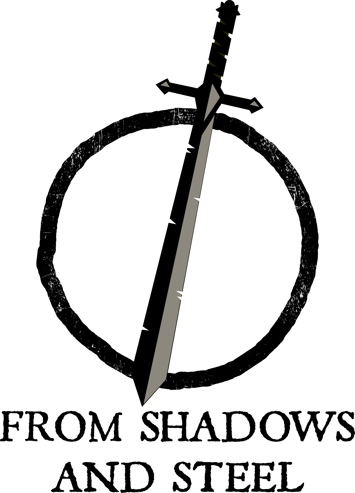

# From-shadows-and-steel

> *Sacrifice stability for survival. Find the truth before the town consumes itself.*

  

## Overview
**From Shadows and Steel** is an indie dark fantasy game that seamlessly blends town management, psychological horror, and blind deduction RPG mechanics. You step into the role of a newly appointed Mayor in a town on the brink of collapse, plagued by mysterious disappearances and rising paranoia. 

You must balance the economy, manage the collective fear of your citizens, and investigate the lurking entity—all while sending brave (or desperate) adventurers into the dark to gather vital resources.

## The Daily Loop
The game is structured around a strict three-phase daily cycle:

- **Morning (Administration & Crisis):** Face the demands of your terrified citizens. Manage critical resources (Food, Materials) and make tough moral choices. Keep the "Fear Level" in check before riots break out or production paralyzes.
- **Afternoon (Investigation):** Spend your limited Action Points (AP) to interrogate NPCs, gather clues, and connect them on your Corkboard. *The game will not hold your hand*: the mystery relies on blind deduction, and your conclusions might be entirely wrong.
- **Night (Expeditions):** The town locks down. Send recruited adventurers—spanning unique races like Beastmen, Undead, and Demons—into dangerous dungeons to fight, gather loot, and uncover secrets.

## Key Features
- **Blind Mystery System:** Prepare your town's defenses based purely on your own deductions. You won't know if you're facing a Vampire, a Cult, or a Werewolf until the climactic siege begins.
- **Fear Management:** Fear is a tangible mechanic. High panic levels reduce worker efficiency and trigger negative narrative events.
- **Tactical Expeditions:** Build synergies between different adventurer classes and races to maximize your chances of survival in 4 distinct biomes.
- **High Stakes:** Permadeath for adventurers and severe consequences for poor mayoral management. Every choice has a cost.

## Technical Details
- **Game Engine:** Unity 
- **Languages:** English, Spanish

## Development Status
### Phase 1: Pre-Alpha / Early Development (Current Phase)
*Goal: Build the base technical architecture and validate logical systems.*
- [x] **Game Design Document (GDD) & Core Concepts:** General concept, game flow, and mathematical balance defined.
- [x] **Version Control & Architecture Setup:** Repository setup and basic structure.
- [ ] **Data Architecture:** `ScriptableObjects` architecture for databases (items, races, classes).
- [ ] **Managers:** Implementation of global Managers (`GameManager`, `TimeManager`, `ResourceManager`).
- [ ] **Core Systems Implementation:** Time system logic, Base economy (Consumption & AP), and Corkboard logic engine.
- [ ] **UI/UX Prototyping:** Grayboxing the main screen and Mayor's desk interface.

### Phase 2: Vertical Slice / MVP (Minimum Viable Product)
*Goal: First fully playable game loop (Management -> Deduction -> Expedition).*
- [ ] **Core Loop Integration:** Full day flow setup.
- [ ] **Stress System:** Mathematical implementation of Fear Thresholds.
- [ ] **First Entity:** Full mechanical implementation of 1 main monster and its clues.
- [ ] **Basic Expeditions:** Probability-based night incursions.

### Phase 3: Alpha (Content Expansion)
*Goal: Flesh out the technical skeleton with all databases and secondary systems.*
- [ ] **Full Village:** Logic for construction of all interactive buildings.
- [ ] **Dynamic Population:** Implementation of all races and consumption synergies.
- [ ] **RPG Progression:** Full class trees and XP/Honor system.
- [ ] **Complete Ecosystem:** All 4 dungeons, defensive wave system, and the 4 Main Entities.

### Phase 4: Beta (Art, Audio, and Polish)
*Goal: Replace the visual prototype with final assets and balance the game.*
- [ ] **Visual Aesthetics:** Integration of "PSX HD / Retro Modern" style characters over Low-Poly Diorama environments.
- [ ] **Soundscape & Dynamic Audio:** Audio reacting in real-time to the village's fear level.
- [ ] **General Balance:** Fine-tuning of loot tables and damage formulas.

### Phase 5: Launch & Marketing
*Goal: Package the experience for players and commercial distribution.*
- [ ] **Narrative Tutorial:** Scripting Days 1 to 4.
- [ ] **Public Demo:** Packaging the Vertical Slice for distribution.
- [ ] **Steam Page:** Creation of the official Steam page.
- [ ] **Launch (v1.0)**

---

## Developer's Note
- I'm a solo dev, so expect slow progress over time. I will try my best to deliver the project, but I am going at my own pace—there is no rushing this game. If you have any suggestions or comments about the project, you can join the community down below: 
  [Join the FS&S Discord](https://discord.gg/3s2YqwvgK9)
- This project is also my first game, so expect some bugs or a bit of a mess under the hood. Thank you for your patience and support!

© 2026 From Shadows and Steel. All rights reserved.
